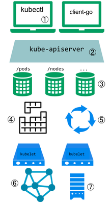

# Extending Kubernetes

https://kubernetes.io/docs/concepts/extend-kubernetes/extend-cluster/

1. **kubectl**: Users often interact with the Kubernetes API using kubectl. Kubectl plugins extend the kubectl binary. They only affect the individual user’s local environment, and so cannot enforce site-wide policies.
2. **API**: The apiserver handles all requests. Several types of extension points in the apiserver allow authenticating requests, or blocking them based on their content, editing content, and handling deletion. These are described in the [API Access Extensions](https://kubernetes.io/docs/concepts/overview/extending#api-access-extensions) section.
3. **CRD**: The apiserver serves various kinds of resources. Built-in resource kinds, like pods, are defined by the Kubernetes project and can’t be changed. You can also add resources that you define, or that other projects have defined, called Custom Resources, as explained in the [Custom Resources](https://kubernetes.io/docs/concepts/overview/extending#user-defined-types) section. Custom Resources are often used with API Access Extensions.
4. **Scheduler**: The Kubernetes scheduler decides which nodes to place pods on. There are several ways to extend scheduling. These are described in the [Scheduler Extensions](https://kubernetes.io/docs/concepts/overview/extending#scheduler-extensions) section.
5. **CRD**: Much of the behavior of Kubernetes is implemented by programs called Controllers which are clients of the API-Server. Controllers are often used in conjunction with Custom Resources.
6. **CNI**: The kubelet runs on servers, and helps pods appear like virtual servers with their own IPs on the cluster network. [Network Plugins](https://kubernetes.io/docs/concepts/overview/extending#network-plugins) allow for different implementations of pod networking.
7. **CSI**: The kubelet also mounts and unmounts volumes for containers. New types of storage can be supported via [Storage Plugins](https://kubernetes.io/docs/concepts/overview/extending#storage-plugins).

- API Extensions
  - (CRD) User-Defined Types
  - (Operator) Combining New APIs with Automation
  - Changing Built-in Resources
  - API Access Extensions
  - Authentication
  - Authorization
  - Dynamic Admission Control
- Infrastructure Extensions
  - Storage Plugins
  - Device Plugins
  - Network Plugins
  - Scheduler Plugins
  - Scheduler Extensions