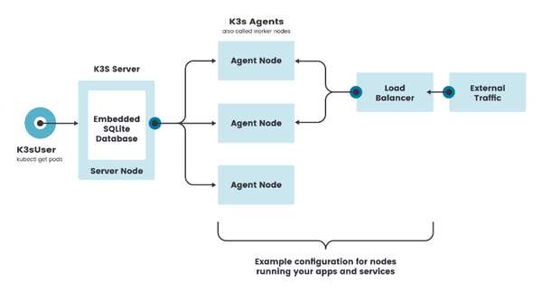
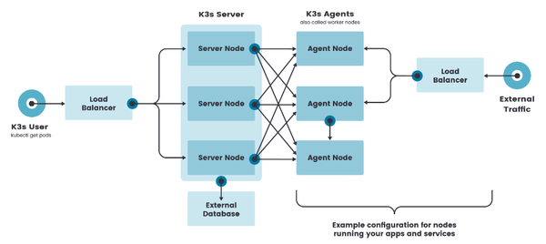

# K3s

<!-- @import "[TOC]" {cmd="toc" depthFrom=2 depthTo=6 orderedList=false} -->

<!-- code_chunk_output -->

- [Architecture](#architecture)

<!-- /code_chunk_output -->

## Architecture

Single-server Setup with an Embedded DB

High-Availability K3s Server with an External DB

Fixed Registration Address for Agent Nodes

Agent nodes are registered with a websocket connection initiated by the `k3s agent` process, and the connection is maintained by a client-side load balancer running as part of the agent process.

Agents will register with the server using the node cluster secret along with a randomly generated password for the node, stored at `/etc/rancher/node/password`. The server will store the passwords for individual nodes at `/var/lib/rancher/k3s/server/cred/node-passwd`, and any subsequent attempts must use the same password.

If the `/etc/rancher/node` directory of an agent is removed, the password file should be recreated for the agent, or the entry removed from the server.

A unique node ID can be appended to the hostname by launching K3s servers or agents using the `--with-node-id` flag.

## Quick-Start Guide

https://rancher.com/docs/k3s/latest/en/quick-start/