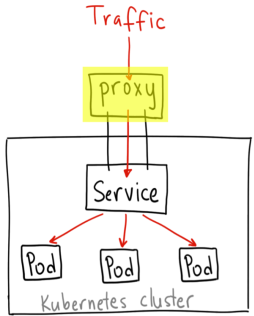
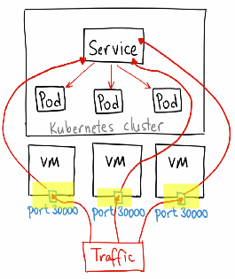
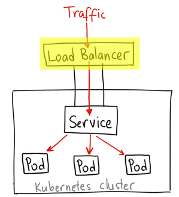

# Kubernetes

- terraform + libvirt over ssh https://github.com/dmacvicar/terraform-provider-libvirt refer kubeone

<!-- @import "[TOC]" {cmd="toc" depthFrom=2 depthTo=4 orderedList=false} -->

<!-- code_chunk_output -->

- [Runtime](#runtime)
  - [Workloads Controllers](#workloads-controllers)
    - [ReplicationController](#replicationcontroller)
    - [ReplicaSet](#replicaset)
    - [Deployment](#deployment)
    - [StatefulSet](#statefulset)
    - [DaemonSet](#daemonset)
    - [Job & CronJob](#job-cronjob)
  - [Configuration](#configuration)
    - [ConfigMap](#configmap)
    - [Secret](#secret)
    - [Manage Resource](#manage-resource)
    - [Pod Overhead](#pod-overhead)
    - [Pod Priority and Preemption](#pod-priority-and-preemption)
- [Network](#network)
  - [DNS](#dns)
  - [Service: Access from external cluster](#service-access-from-external-cluster)
    - [ClusterIP](#clusterip)
    - [NodePort](#nodeport)
    - [LoadBalancer](#loadbalancer)
    - [Ingress](#ingress)
  - [EndPoint](#endpoint)
- [Storage](#storage)
  - [Volume Spec](#volume-spec)
  - [Volume Type](#volume-type)
    - [emptyDir](#emptydir)
    - [hostPath](#hostpath)
    - [local](#local)
    - [nfs](#nfs)
  - [CSI](#csi)
- [Security](#security)
- [Management](#management)
- [Tools](#tools)
- [Reference](#reference)

<!-- /code_chunk_output -->

- [ ] setup k8s via libvird over ssh with 3 master
- [ ] Interface
  - [ ] CRI
  - [ ] CNI
- [ ] use curl to access k8s apiserver
- [ ] write go code to access k8s apiserver
- [ ] helm
- [ ] k8s scheduler
- [ ] kustomize
- [ ] annotation
- [ ] node affinity
- [ ] apply or create https://kubernetes.io/docs/tasks/manage-kubernetes-objects/declarative-config/#how-to-create-objects, https://kubernetes.cn/docs/tasks/manage-kubernetes-objects/imperative-config/#how-to-delete-objects
- [ ] k3s

```bash
$ k run nginx --image=nginx --port=80
$ k expose pod nginx --type=NodePort
$ k get all -l app=nginx -o wide
NAME        READY   STATUS    RESTARTS   AGE    IP           NODE    NOMINATED NODE   READINESS GATES
pod/nginx   1/1     Running   0          3h1m   10.244.2.5   node2   <none>           <none>

NAME            TYPE       CLUSTER-IP    EXTERNAL-IP   PORT(S)        AGE   SELECTOR
service/nginx   NodePort   10.98.44.43   <none>        80:30165/TCP   74s   app=nginx
$ curl http://10.0.0.10:30165
$ kubectl port-forward pod/nginx --address 0.0.0.0 :30165
$ curl http://10.144.48.106:30165
$ k logs -f pod/nginx
$ k exex -it pod/nginx sh
$ k delete all -l app=nginx

dump pod
$ k get pod nginx -o yaml
monitor changes
$ k get events -w
```

## Runtime

- [ ] CRD
- [ ] HorizentalPodAutoScale (hpa)
- [ ] Nodes (no)
- [ ] Pods (po)
- [ ] PodPreset
- [ ] PodTemplates
- [ ] ProdSecurityPolicies (psp)
- [ ] ResourceQuotas (quotas)
- [ ] PodDisruptionBudge (pdb)
- [ ] ReplicaionController (rc)
- [ ] ReplicaSets (rs)

### Workloads Controllers

- origin: https://www.cnblogs.com/boshen-hzb/p/7097811.html
- TODO: https://kubernetes.io/docs/concepts/workloads/controllers/deployment/

```bash
$ k create -f nginx.yaml
$ k scale deploy nginx --replicas 2
$ k set image deployment.apps/nginx-deployment nginx=nginx:1.18
$ k rollout undo deployment.apps/nginx-deployment

status
$ kubectl rollout status deployments review-demo
$ kubectl describe deployments review-demo
$ kubectl rollout history deployments --namespace=scm

upgrade
$ kubectl set image deployment/review-demo review-demo=library/review-demo:0.0.1 --namespace=scm

operations
$ kubectl rollout pause deployment/review-demo --namespace=scm
$ kubectl rollout resume deployment/review-demo --namespace=scm
$ kubectl rollout undo deployment/review-demo --namespace=scm
$ kubectl rollout undo deployment/review-demo --to-revision=2 --namespace=scm
```

#### ReplicationController

- 确保pod数量
- 确保pod健康
- 弹性伸缩
- 滚动升级

#### ReplicaSet

在新版本的Kubernetes中建议使用ReplicaSet来取代ReplicationCtronller。ReplicaSet跟ReplicationCtronller没有本质的不同，只是名字不一样，并且ReplicaSet支持集合式的selector

#### Deployment

- Replication Controller全部功能
- 事件和状态查看
- 回滚
- 版本记录
- 暂停和启动
- 多种升级方案：Recreate：删除所有已存在的pod,重新创建新的; RollingUpdate：滚动升级，逐步替换的策略，同时滚动升级时，支持更多的附加参数，例如设置最大不可用pod数量，最小升级间隔时间等等。

YAML parameters

- maxSurge: 1 表示滚动升级时会先启动1个pod
- maxUnavailable: 1 表示滚动升级时允许的最大Unavailable的pod个数
- terminationGracePeriodSeconds: 如果需要更优雅地关闭，则可以使用k8s提供的pre-stop lifecycle hook 的配置声明，将会在发送SIGTERM之前执行
- livenessProbe
- readinessProbe: readinessProbe.initialDelaySeconds可以设置为系统完全启动起来所需的最少时间，livenessProbe.initialDelaySeconds可以设置为系统完全启动起来所需的最大时间+若干秒

Example

```yaml
apiVersion: extensions/v1beta1
kind: Deployment
metadata:
  name: review-demo
  namespace: scm
  labels:
    app: review-demo
spec:
  replicas: 3
#  minReadySeconds: 60     #滚动升级时60s后认为该pod就绪
  strategy:
    rollingUpdate:  ##由于replicas为3,则整个升级,pod个数在2-4个之间
      maxSurge: 1      #滚动升级时会先启动1个pod
      maxUnavailable: 1 #滚动升级时允许的最大Unavailable的pod个数
  template:
    metadata:
      labels:
        app: review-demo
    spec:
      terminationGracePeriodSeconds: 60 ##k8s将会给应用发送SIGTERM信号，可以用来正确、优雅地关闭应用,默认为30秒
      containers:
      - name: review-demo
        image: library/review-demo:0.0.1-SNAPSHOT
        imagePullPolicy: IfNotPresent
        livenessProbe: #kubernetes认为该pod是存活的,不存活则需要重启
          httpGet:
            path: /health
            port: 8080
            scheme: HTTP
          initialDelaySeconds: 60 ## equals to the maximum startup time of the application + couple of seconds
          timeoutSeconds: 5
          successThreshold: 1
          failureThreshold: 5
        readinessProbe: #kubernetes认为该pod是启动成功的
          httpGet:
            path: /health
            port: 8080
            scheme: HTTP
          initialDelaySeconds: 30 ## equals to minimum startup time of the application
          timeoutSeconds: 5
          successThreshold: 1
          failureThreshold: 5
        resources:
          # keep request = limit to keep this container in guaranteed class
          requests:
            cpu: 50m
            memory: 200Mi
          limits:
            cpu: 500m
            memory: 500Mi
        env:
          - name: PROFILE
            value: "test"
        ports:
          - name: http
            containerPort: 8080
```

#### StatefulSet

https://kubernetes.io/docs/concepts/workloads/controllers/statefulset/

#### DaemonSet

https://kubernetes.io/docs/concepts/workloads/controllers/daemonset/

#### Job & CronJob

- [Example job.yaml](./example/workload/job.yaml)
- [Job Spec](https://kubernetes.io/docs/concepts/workloads/controllers/jobs-run-to-completion/#writing-a-job-spec)
- [Job Pattern](https://kubernetes.io/docs/concepts/workloads/controllers/jobs-run-to-completion/#job-patterns)

```bash
k apply -f example/workload/job.yaml
k logs jobs/pi
k describe jobs/pi
k get pods --selector=job-name=pi --output=jsonpath='{.items[*].metadata.name}'
```

Job spec

- .spec.backoffLimit
- .spec.template.spec.restartPolicy
- kubectl delete jobs/pi
- .spec.activeDeadlineSeconds
- .spec.ttlSecondsAfterFinished
- .spec.completions
- .spec.parallelism

CronJob Spec

- startingDeadlineSeconds
- concurrencyPolicy

### Configuration

#### ConfigMap

Origin: https://kubernetes.io/docs/concepts/configuration/overview/

Example: 

- [example configmap.yaml](./example/configmap.yaml)
- [example/volume/config-map.yaml](example/volume/config-map.yaml)

#### Secret
secret 顧名思義就是存放機密性的資料，而 secret volume 有以下幾個特點：

- 要使用 secret volume 必須先定義 secret resource object 後，再掛載為 secret volume
- secret volume 會存在於 /tmpfs 中，也就是 RAM 中，不會存在於硬碟上
- 若透過 subPath 掛載 secret volume，若是後續 secret volume 有更新，就不會反應到該 subPath 上

[How to use secret?](https://kubernetes.io/docs/concepts/configuration/secret/)

```bash
# Create files needed for the rest of the example.
echo -n 'admin' > ./username.txt
echo -n '1f2d1e2e67df' > ./password.txt
kubectl create secret generic db-user-pass --from-file=./username.txt --from-file=./password.txt
kubectl create secret generic db-user-pass --from-file=username=./username.txt --from-file=password=./password.txt
kubectl get secrets
kubectl describe secrets/db-user-pass

# create manually
cat > secret.yaml <<EOL
apiVersion: v1
kind: Secret
metadata:
  name: mysecret
type: Opaque
data:
  username: $(echo -n 'admin' | base64)
  password: $(echo -n '1f2d1e2e67df' | base64)
EOL
kubectl apply -f ./secret.yaml

# decode secret
$ kubectl get secret mysecret -o yaml
apiVersion: v1
kind: Secret
metadata:
  creationTimestamp: 2016-01-22T18:41:56Z
  name: mysecret
  namespace: default
  resourceVersion: "164619"
  uid: cfee02d6-c137-11e5-8d73-42010af00002
type: Opaque
data:
  username: YWRtaW4=
  password: MWYyZDFlMmU2N2Rm
$ echo 'MWYyZDFlMmU2N2Rm' | base64 --decode
```

- `ConfigMapAndSecretChangeDetectionStrategy`
- `ImmutableEmphemeralVolumes` `immutable`
- `imagePullSecrets` to pass a secret that contains a Docker
  - [Add ImagePullSecrets to a service account](https://kubernetes.io/docs/concepts/containers/images/#specifying-imagepullsecrets-on-a-pod)
  - [Injecting Information into Pods Using a PodPreset](https://kubernetes.io/docs/tasks/inject-data-application/podpreset/)

#### Manage Resource

Request and Limit: it’s possible (and allowed) for a container to use more resource than its **request** for that resource specifies. However, a container is not allowed to use more than its resource **limit**

Each Container of a Pod can specify one or more of the following:

- spec.containers[].resources.limits.cpu
- spec.containers[].resources.limits.memory
- spec.containers[].resources.limits.hugepages-<size>
- spec.containers[].resources.requests.cpu
- spec.containers[].resources.requests.memory
- spec.containers[].resources.requests.hugepages-<size>
- spec.containers[].resources.limits.ephemeral-storage
- spec.containers[].resources.requests.ephemeral-storage

Extended Resources: https://kubernetes.io/docs/concepts/configuration/manage-resources-containers/#managing-extended-resources

Troubleshooting

- kubectl describe pod frontend | grep -A 3 Events
- kubectl describe nodes e2e-test-node-pool-4lw4
- kubectl describe pod simmemleak-hra99

#### Pod Overhead

Pod Overhead is a feature for accounting for the resources consumed by the Pod infrastructure on top of the container requests & limits. (used by kata container)

#### Pod Priority and Preemption

https://kubernetes.io/docs/concepts/configuration/pod-priority-preemption/

### Reference

- Kustomize example: [kustomize](./kustomize)

## Network

- [ ] NetworkPolicies (netpol)
- [ ] Endpoints (dp)

Reference

- https://www.hwchiu.com/cni.html
- https://www.hwchiu.com/tags/CNI/
- CNI comparison: https://itnext.io/benchmark-results-of-kubernetes-network-plugins-cni-over-10gbit-s-network-updated-april-2019-4a9886efe9c4
- traefik: https://docs.traefik.io/v1.7/user-guide/kubernetes/

### DNS

- https://kubernetes.io/zh/docs/concepts/services-networking/dns-pod-service/
- troubleshooting: https://kubernetes.io/docs/tasks/administer-cluster/dns-debugging-resolution/
- https://coredns.io/2017/05/08/custom-dns-entries-for-kubernetes/
- https://coredns.io/plugins/forward/
- https://coredns.io/manual/toc/

Troubleshooting

```bash
k port-forward svc/grafana 12345:80 --address 0.0.0.0
k run -it netutil --image=joffotron/docker-net-tools --rm --overrides='{"apiVersion": "v1", "spec": {"nodeSelector": { "kubernetes.io/arch": "amd64" }}}'
curl <service ip>:<service port>
dig +search <svc> <prometheus-1-server>
```

### Service: Access from external cluster

Origin: http://dockone.io/article/4884

#### ClusterIP



- ClusterIP 服务是 Kubernetes 的默认服务。
- 集群内的其它应用都可以访问该服务。
- 集群外部无法访问它。

When to use

- 由于某些原因，你需要调试你的服务，或者需要直接通过笔记本电脑去访问它们。
- 容许内部通信，展示内部仪表盘等。

access out of cluster

```bash
kubectl proxy --port=8080
http://localhost:8080/api/v1/proxy/namespaces/default/services/my-internal-service:http/
```

#### NodePort



- 在所有节点（虚拟机）上开放一个特定端口，任何发送到该端口的流量都被转发到对应服务。

When to use

- 每个端口只能是一种服务
- 端口范围只能是 30000-32767
- 如果节点/VM 的 IP 地址发生变化，你需要能处理这种情况。

#### LoadBalancer



- LoadBalancer 服务是暴露服务到 internet 的标准方式。
- 在 GKE 上，这种方式会启动一个 Network Load Balancer，它将给你一个单独的 IP 地址，转发所有流量到你的服务。

When to use

- 所有通往你指定的端口的流量都会被转发到对应的服务。它没有过滤条件，没有路由等。这意味着你几乎可以发送任何种类的流量到该服务，像 HTTP，TCP，UDP，Websocket，gRPC 或其它任意种类。
- 一个用 LoadBalancer 暴露的服务都会有它自己的 IP 地址，每个用到的 LoadBalancer 都需要付费，这将是非常昂贵的。

#### Ingress

Described in [Ingress](ingress.md)

- Ingress 事实上不是一种服务类型。
- 相反，它处于多个服务的前端，扮演着"智能路由"或者集群入口的角色。

- [Ingress comparison](https://medium.com/flant-com/comparing-ingress-controllers-for-kubernetes-9b397483b46b)

Factors of traffic distribution

- A/B testing
  - A/B testing (also sometimes referred to as split testing) is the practice of showing two variants of the same web page to different segments of website visitors at the same time and comparing which variant drives more conversions.  
- Blue/Green release
  - You can do a blue-green release if you've tested the new version in a testing environment and are very certain that the new version will function correctly in production. Always using feature toggles is a good way to increase your confidence in a new version, since the new version functions exactly like the old until someone flips a feature toggle.
- Canary release
  - You need to do a canary release if you're not completely certain that the new version will function correctly in production. Even if you are a thorough tester, the Internet is a large and complex place and is always coming up with unexpected challenges. Even if you use feature toggles, one might be implemented incorrectly.
- Shadowing (mirroring)

### EndPoint

```bash
dig wordpress.default.svc.cluster.local srv @127.0.0.1 -p 41565 +tcp
k port-forward service/kube-dns :53 --address 0.0.0.0 -n kube-system
```

## Storage

Reference:

- https://www.hwchiu.com/tags/CSI/
- https://godleon.github.io/blog/Kubernetes/k8s-Volume-Overview/
- https://ieevee.com/tech/2019/01/17/local-volume.html

### Volume Spec

這裡 PV 會有四種狀態 (STATUS)

- Available：表示 PV 為可用狀態
- Bound：表示已綁定到 PVC
- Released：PVC 已被刪除，但是尚未回收
- Failed：回收失敗

PV 有三種回收策略 (RECLAIM POLICY)，分別是

- Retain：手動回收
- Recycle：透過刪除命令 rm -rf /thevolume/*
- Delete：用於 AWS EBS, GCE PD, Azure Disk 等儲存後端，刪除 PV 的同時也會一併刪除後端儲存磁碟。

use nfs-client to as StorageClass: [example/volume/nfs-client.yaml](example/volume/nfs-client.yaml)

### Volume Type

- subPath: 要掛載的目錄中可能包含了多個子目錄，而這些子目錄恰巧又分別被多個不同的 container 使用，此時就可以透過 subPath 的方式來簡化 volume 的設定
- Expanded Environment Variables: $(POD_NAME) - 透過 Expanded Environment Variables　的搭配，可以在 YAML 定義檔中，使用與 pod 相關的識別資訊，可以讓 subPath 在使用上更加的彈性
- Mount Propagation

#### emptyDir

emptyDir 在使用上有以下幾點特性：

- emptyDir 會在 pod 被分配到特定的 node 後產生，一開始永遠是一個空的目錄
- emptyDir 的 life cycle 是跟著 pod + node 一起走，只要該 pod 持續的在原本的 node 上運行，emptyDir 就會保留著；相反的，只要兩個條件有任一消失，emptyDir 的資料也會跟著消失
- 若是有資料存進去 emptyDir，node 會把資料放在 RAM(設定 emptyDir.medium 為 Memory，emptyDir 會以 tmpfs 的方式提供) or local SSD/HD 上
- 存放在 SSD or HD，取決於 /var/lib/kubelet 目錄位於哪種硬碟上 (也就是說 emptyDir 會存放在 /var/lib/kubelet 目錄中)
- 每個在 pod 中的 container，可以將 emptyDir 掛載在不同的路徑
- 目前無法限制使用量

在官網中有提到一些 emptyDir 的 use case：

- scratch space, such as for a disk-based merge sort
- checkpointing a long computation for recovery from crashes
- holding files that a content-manager Container fetches while a webserver Container serves the data

#### hostPath

通常這不是一般 pod 會用的 volume type，只有在一些情況下例外，例如：

- container 需要監控 host Docker 的內部運作細節，會需要掛載 host /var/lib/docker 資料夾
- container 中執行 cAdvisor，需要掛在 host /sys 目錄
- init container，用來產生另一個 container 需要的 host path

#### local

在local volume出现之前，statefulsets也可以利用本地SSD，方法是配置hostPath，并通过nodeSelector或者nodeAffinity绑定到具体node上。但hostPath的问题是，管理员需要手动管理集群各个node的目录，不太方便。

下面两种类型应用适合使用local volume。

- 数据缓存，应用可以就近访问数据，快速处理。
- 分布式存储系统，如分布式数据库Cassandra ，分布式文件系统ceph/gluster

相較於 hostPath，local volume type 有以下幾點的不同：

- 只能以 PersistentVolume 的方式被使用，尚不支援 dynamic provisioning
- 由於 local 可以額外設定 nodeAffinity，因此 k8s scheduler 會協助挑選合適的 node 來使用

local volume type 看似比 hostPath 更有彈性些，但使用上還是有些地方必須注意，例如：

- local volume 的可用性依然是跟著 node 走，因為不一定每個 node 都有相同的 disk or partition 配置
- 如果 node 的狀態轉變成 unhealthy，同時也會造成 local volume 無法使用(因為資料就是存在於該 unhealthy node 上)，進而造成掛載 local volume 的 pod 也無法存取資料

承上，若 application 只能使用 local volume 的話，那就要考量到資料無法正常存取時的容錯設計

Examples:

- [example/volume/local.yaml](example/volume/local.yaml)
- [External Storage](https://github.com/kubernetes-incubator/external-storage): [example/volume/external-storage.yaml](example/volume/external-storage.yaml)

#### nfs

NFS server could not start normally in container, because [it's required special parameters to mount overlayfs](https://serverfault.com/questions/949892/nfs-export-an-overlay-of-ext4-and-btrfs). [NFS-Client](https://www.hwchiu.com/kubernetes-storage-ii.html) is better solution.

In every nodes,

```bash
apt install -y nfs-common
```

In NFS server,

```bash
$ cat /etc/exports
/home/u/nfs/nfs 10.144.48.106(rw,sync,no_subtree_check,insecure)
$ chmod 777 /home/u/nfs/nfs
$ exportfs -r
$ showmount -e localhost
```

```bash
helm install nfs-client stable/nfs-client-provisioner \
  --set nfs.server=10.144.48.106 \
  --set nfs.path=/home/u/nfs/nfs
```

use nfs-client to as StorageClass: [example/volume/nfs-client.yaml](example/volume/nfs-client.yaml)

- Why `insecure` required? [access denied](https://serverfault.com/questions/107546/mount-nfs-access-denied-by-server-while-mounting)
- Example
  - [example/volume/nfs.yaml](example/volume/nfs.yaml)

### CSI

https://www.hwchiu.com/tags/CSI/


## Security

- [ ] ClusterRoleBindings
- [ ] ClusterRole
- [ ] LimitRanges (limits)
- [ ] Namespaces (ns)
- [ ] RoleBindings
- [ ] Roles
- [ ] ServiceAccount (sa)

```bash
$ k api-resources
NAME                              SHORTNAMES   APIGROUP                       NAMESPACED   KIND
bindings                                                                      true         Binding
componentstatuses                 cs                                          false        ComponentStatus
configmaps                        cm                                          true         ConfigMap
endpoints                         ep                                          true         Endpoints
events                            ev                                          true         Event
limitranges                       limits                                      true         LimitRange
namespaces                        ns                                          false        Namespace
nodes                             no                                          false        Node
persistentvolumeclaims            pvc                                         true         PersistentVolumeClaim
persistentvolumes                 pv                                          false        PersistentVolume
pods                              po                                          true         Pod
podtemplates                                                                  true         PodTemplate
replicationcontrollers            rc                                          true         ReplicationController
resourcequotas                    quota                                       true         ResourceQuota
secrets                                                                       true         Secret
serviceaccounts                   sa                                          true         ServiceAccount
services                          svc                                         true         Service
mutatingwebhookconfigurations                  admissionregistration.k8s.io   false        MutatingWebhookConfiguration
validatingwebhookconfigurations                admissionregistration.k8s.io   false        ValidatingWebhookConfiguration
customresourcedefinitions         crd,crds     apiextensions.k8s.io           false        CustomResourceDefinition
apiservices                                    apiregistration.k8s.io         false        APIService
controllerrevisions                            apps                           true         ControllerRevision
daemonsets                        ds           apps                           true         DaemonSet
deployments                       deploy       apps                           true         Deployment
replicasets                       rs           apps                           true         ReplicaSet
statefulsets                      sts          apps                           true         StatefulSet
tokenreviews                                   authentication.k8s.io          false        TokenReview
localsubjectaccessreviews                      authorization.k8s.io           true         LocalSubjectAccessReview
selfsubjectaccessreviews                       authorization.k8s.io           false        SelfSubjectAccessReview
selfsubjectrulesreviews                        authorization.k8s.io           false        SelfSubjectRulesReview
subjectaccessreviews                           authorization.k8s.io           false        SubjectAccessReview
horizontalpodautoscalers          hpa          autoscaling                    true         HorizontalPodAutoscaler
cronjobs                          cj           batch                          true         CronJob
jobs                                           batch                          true         Job
certificatesigningrequests        csr          certificates.k8s.io            false        CertificateSigningRequest
leases                                         coordination.k8s.io            true         Lease
endpointslices                                 discovery.k8s.io               true         EndpointSlice
events                            ev           events.k8s.io                  true         Event
ingresses                         ing          extensions                     true         Ingress
ingressclasses                                 networking.k8s.io              false        IngressClass
ingresses                         ing          networking.k8s.io              true         Ingress
networkpolicies                   netpol       networking.k8s.io              true         NetworkPolicy
runtimeclasses                                 node.k8s.io                    false        RuntimeClass
poddisruptionbudgets              pdb          policy                         true         PodDisruptionBudget
podsecuritypolicies               psp          policy                         false        PodSecurityPolicy
clusterrolebindings                            rbac.authorization.k8s.io      false        ClusterRoleBinding
clusterroles                                   rbac.authorization.k8s.io      false        ClusterRole
rolebindings                                   rbac.authorization.k8s.io      true         RoleBinding
roles                                          rbac.authorization.k8s.io      true         Role
priorityclasses                   pc           scheduling.k8s.io              false        PriorityClass
csidrivers                                     storage.k8s.io                 false        CSIDriver
csinodes                                       storage.k8s.io                 false        CSINode
storageclasses                    sc           storage.k8s.io                 false        StorageClass
volumeattachments                              storage.k8s.io                 false        VolumeAttachment
```

## Management

- [ ] ComposenentStatues (cs)
- [ ] Events (ev)

## Tools

- tui: k9s
- gui: https://github.com/vmware-tanzu/octant
- ELK
- Prometheus Grafana
- [Kustomize](https://kubernetes.io/docs/tasks/manage-kubernetes-objects/kustomization/)

**kubectl Plugins**

- management: https://github.com/kubernetes-sigs/krew
- introduction: https://zhuanlan.zhihu.com/p/95664681
- example source code of plugin: https://github.com/kubernetes/sample-cli-plugin/
  - library: https://github.com/kubernetes/client-go

krew plugin must install

```text
PLUGIN             VERSION
access-matrix      v0.4.4
ctx                v0.8.0
df-pv              v0.1.5
doctor             v0.3.0
grep               v1.2.2
iexec              v1.4.0
krew               v0.3.4
ns                 v0.7.1
resource-capacity  v0.4.0
tail               v0.10.1
view-allocations   v0.7.2
```

## Reference

**Short tutorials**

- 五分鐘 Kubernetes 有感, https://medium.com/@evenchange4/%E4%BA%94%E5%88%86%E9%90%98-kubernetes-%E6%9C%89%E6%84%9F-e51f093cb10b
- Setup VirtualBox Vagrant: https://github.com/LocusInnovations/k8s-vagrant-virtualbox

**Full tutorials**

- Kubernetes Handbook: https://jimmysong.io/kubernetes-handbook/
- k3s arch: https://itnext.io/benchmark-results-of-kubernetes-network-plugins-cni-over-10gbit-s-network-updated-april-2019-4a9886efe9c4

**YAML Examples**

- PHP Guestbook Application with Redis: https://kubernetes.io/docs/tutorials/stateless-application/guestbook/

**Reference**

- API: https://kubernetes.io/docs/reference/generated/kubernetes-api/v1.18/
- kubectl: https://kubernetes.io/docs/reference/kubectl/overview/