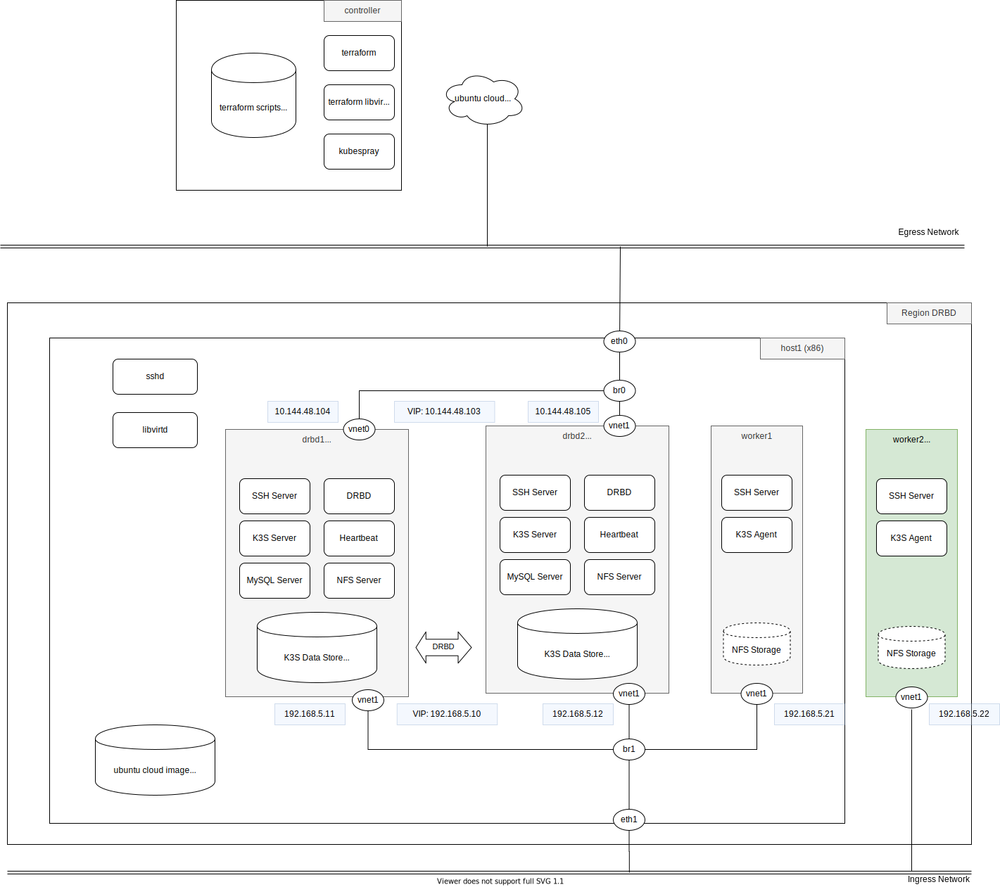

# terraform

<!-- @import "[TOC]" {cmd="toc" depthFrom=2 depthTo=6 orderedList=false} -->

<!-- code_chunk_output -->

- [terraform](#terraform)
  - [Environment](#environment)
  - [Enable libvirt for Host](#enable-libvirt-for-host)
  - [K3S over DRBD](#k3s-over-drbd)
  - [Service on master nodes](#service-on-master-nodes)
    - [K3S](#k3s)
  - [K3S workers](#k3s-workers)
  - [K3S workers by RPi 4](#k3s-workers-by-rpi-4)
  - [Reference](#reference)

<!-- /code_chunk_output -->

<!--  -->

## Environment



| IP            | FQDN                        | Description            |
| ------------- | --------------------------- | ---------------------- |
| 10.144.48.103 | joplin.mycluster            | cluster public address |
| 10.144.48.106 | host1.joplin.mycluster      | physical node          |
| 10.144.48.104 | drbd1.joplin.mycluster      | drbd 1                 |
| 10.144.48.105 | drbd2.joplin.mycluster      | drbd 2                 |
| 192.168.5.22  | worker2.joplin.mycluster    | worker 2               |
| 10.144.48.103 | harbor.svc.joplin.mycluster | Harbor                 |

## Enable libvirt for Host

1. Prepare Ubuntu 18.04. Install libvirt and SSH.


  ```bash
  /etc/libvirt/qemu.conf
  security_driver = "none"
  ```

Install terraform, terrafrom_libvirt

```bash
terraform init
terraform plan
terraform apply
terraform show
terraform destroy
terraform -var=libvirt_uri=qemu+ssh://u@host1.joplin.mycluster/system -var=node_number=17 apply
terraform -var=uri=qemu+ssh://u@host1.joplin.mycluster.joplin.mycluster/system -var=node=18 apply
terraform -var=uri=qemu+ssh://u@host1.joplin.mycluster:2200/system -var=node=33 apply
```

```bash
virsh
virsh list --all
virsh start node-104
varsh shutdown node-104
varsh destroy node-104
virsh undefined ubuntu-terraform3
virsh net-dhcp-leases default
virsh net-define ./virsh5.xml
virsh net-list -a
virsh net-autostart k8s
virsh net-start k8s
virsh net-dumpxml k8s
```

## K3S over DRBD

In this section, we will create two nodes DRBD by libvirt. The architecture likes region-c. We first configure IP address, create nodes via terraform, and setup DRBD via ansible. After completion, DRBD is mounted at `/opt/nfs`. You may try to shutdown one of machine to verify viability.

1. Update IP address in `region-drbd/terraform.tfvars.json` and `inventory`

2. Create nodes

    <details>
    <summary>terraform apply -auto-approve</summary>
    <pre class="language-shell"><code>
    > cd region-drbd
    > terraform apply -auto-approve
    data.template_file.user_data: Refreshing state...
    data.template_file.network_config[1]: Refreshing state...
    data.template_file.network_config[0]: Refreshing state...
    libvirt_pool.ubuntu: Creating...
    libvirt_volume.drbd[1]: Creating...
    libvirt_volume.drbd[0]: Creating...
    libvirt_network.drbdnet: Creating...
    libvirt_network.k8snet: Creating...
    libvirt_volume.drbd[1]: Creation complete after 0s [id=/var/lib/libvirt/images/drbd-105.qcow2]
    libvirt_volume.drbd[0]: Creation complete after 1s [id=/var/lib/libvirt/images/drbd-104.qcow2]
    libvirt_pool.ubuntu: Creation complete after 5s [id=b8954422-64fa-4a5d-98d1-d1846be99748]
    libvirt_network.k8snet: Creation complete after 5s [id=d8b98f26-cd1f-4737-a6e0-9372a7d52c8b]
    libvirt_cloudinit_disk.commoninit[1]: Creating...
    libvirt_cloudinit_disk.commoninit[0]: Creating...
    libvirt_volume.ubuntu1804: Creating...
    libvirt_network.drbdnet: Creation complete after 6s [id=de4b3548-bdbd-4d3c-aa94-c560b185d372]
    libvirt_cloudinit_disk.commoninit[1]: Still creating... [10s elapsed]
    libvirt_cloudinit_disk.commoninit[0]: Still creating... [10s elapsed]
    libvirt_volume.ubuntu1804: Still creating... [10s elapsed]
    libvirt_cloudinit_disk.commoninit[1]: Still creating... [20s elapsed]
    libvirt_cloudinit_disk.commoninit[0]: Still creating... [20s elapsed]
    libvirt_volume.ubuntu1804: Still creating... [20s elapsed]
    libvirt_cloudinit_disk.commoninit[1]: Still creating... [30s elapsed]
    libvirt_cloudinit_disk.commoninit[0]: Still creating... [30s elapsed]
    libvirt_volume.ubuntu1804: Still creating... [30s elapsed]
    libvirt_cloudinit_disk.commoninit[1]: Still creating... [40s elapsed]
    libvirt_cloudinit_disk.commoninit[0]: Still creating... [40s elapsed]
    libvirt_volume.ubuntu1804: Still creating... [40s elapsed]
    libvirt_cloudinit_disk.commoninit[1]: Still creating... [50s elapsed]
    libvirt_volume.ubuntu1804: Still creating... [50s elapsed]
    libvirt_cloudinit_disk.commoninit[0]: Still creating... [50s elapsed]
    libvirt_cloudinit_disk.commoninit[1]: Still creating... [1m0s elapsed]
    libvirt_volume.ubuntu1804: Still creating... [1m0s elapsed]
    libvirt_cloudinit_disk.commoninit[0]: Still creating... [1m0s elapsed]
    libvirt_volume.ubuntu1804: Creation complete after 1m6s [id=/tmp/terraform-provider-libvirt-pool-ubuntu-104/ubuntu1804]
    libvirt_cloudinit_disk.commoninit[0]: Creation complete after 1m7s [id=/tmp/terraform-provider-libvirt-pool-ubuntu-104/commoninit-104.iso;5f245810-c664-0320-72de-15abacd52ba8]
    libvirt_cloudinit_disk.commoninit[1]: Creation complete after 1m7s [id=/tmp/terraform-provider-libvirt-pool-ubuntu-104/commoninit-105.iso;5f245810-ec50-4c75-54bb-77614b85c82b]
    libvirt_volume.master[1]: Creating...
    libvirt_volume.master[0]: Creating...
    libvirt_volume.master[1]: Creation complete after 0s [id=/var/lib/libvirt/images/master-105.qcow2]
    libvirt_volume.master[0]: Creation complete after 1s [id=/var/lib/libvirt/images/master-104.qcow2]
    libvirt_domain.default[0]: Creating...
    libvirt_domain.default[1]: Creating...
    libvirt_domain.default[1]: Creation complete after 3s [id=01444773-7cea-4898-99c5-fce62e9ff298]
    libvirt_domain.default[0]: Creation complete after 3s [id=a21cdb15-6a44-4634-8371-badfe1173f8a]

    Apply complete! Resources: 12 added, 0 changed, 0 destroyed.
    </code></pre>
    </details>

3. Setup DRBD

    <details>
    <summary>ansible-playbook playbook.yml</summary>
    <pre class="language-shell"><code>
    > ansible-galaxy install -r requirements.yml
    - ansible-etc-hosts is already installed, skipping.
    - ansible-ntp is already installed, skipping.
    - ansible-drbd is already installed, skipping.
    > ansible-playbook playbook.yml
    .
    PLAY [drbd_nodes] *************************************************************
    .
    TASK [Gathering Facts] ********************************************************
    ok: [drbd1]
    ok: [drbd2]
    .
    TASK [apt-update : debian | hostname] *******************************************************************************
    changed: [drbd2]
    changed: [drbd1]
    .
    TASK [apt-update : include_tasks] *******************************************************************************
    included: /home/u/workspace/kube/terraform/roles/apt-update/tasks/debian.yml for drbd1, drbd2
    .
    TASK [apt-update : debian | updating packages] *******************************************************************************
    ...
    RUNNING HANDLER [ansible-drbd : restart heartbeat] *******************************************************************************
    changed: [drbd1]
    changed: [drbd2]
    .
    PLAY RECAP ********************************************************************
    drbd1                      : ok=37   changed=24   unreachable=0    failed=0    skipped=5    rescued=0    ignored=0
    drbd2                      : ok=33   changed=20   unreachable=0    failed=0    skipped=9    rescued=0    ignored=0
    </code></pre>
    </detail>

4. Test block device

    <details>
    <summary>virsh -c qemu+ssh://127.0.0.1/system console node-104</summary>
    <pre class="language-shell"><code>
    > virsh -c qemu+ssh://127.0.0.1/system console node-104
    Connected to domain node-104
    Escape character is ^]
    Ubuntu 18.04.4 LTS drbd1 ttyS0
    drbd1 login: ubuntu
    Password:
    Last login: Fri Jul 31 17:57:53 UTC 2020 from 10.144.48.106 on pts/0
    Welcome to Ubuntu 18.04.4 LTS (GNU/Linux 4.15.0-112-generic x86_64)
    ubuntu@drbd1:~$ ls /opt/nfs
    ubuntu@drbd1:~$ touch /opt/nfs/a
    ubuntu@drbd1:~$ sudo drbd-overview
     0:r0/0  Connected Primary/Secondary UpToDate/UpToDate /opt/nfs ext4 40G 49M 38G 1%
    ubuntu@drbd1:~$ sudo shutdown now
    > virsh -c qemu+ssh://127.0.0.1/system console node-105
    ubuntu@drbd2:~$ ls /opt/nfs
    a
    </code></pre>
    </detail>

5. Free nodes

    <details>
    <summary>terraform destroy -auto-approve</summary>
    <pre class="language-shell"><code>
    > terraform destroy -auto-approve
    </code></pre>
    </detail>

K3S can run with SQLite and external database like MySQL and PostgreSQL. However, K3S with MySQL as data store has poor performance on heavy IO operations. The load average generally is above 3 and somtimes above 10 on 2 core CPU with 6 GB RAM. PostgreSQL has a few improvement.

## Service on master nodes

1. K3S
   - CSI
   - prometheus + grafana
   - Harbor
2. apt server
3. container repo
4. helm repo
5. chrony

TODO

1. deploy nfs disable and stop
2. add haresource for nfs start

### K3S

1. CSI

    <details>
    <summary>terraform destroy -auto-approve</summary>
    <pre class="language-shell"><code>
    $ ansible-playbook playbook_env.yml -l drbd_nodes
    $ helm repo add stable https://kubernetes-charts.storage.googleapis.com/
    $ helm install nfs-client stable/nfs-client-provisioner \
        --set nfs.server=192.168.5.10 \
        --set nfs.path=/opt/nfs
    $ kubectl patch storageclass local-path -p '{"metadata": {"annotations":{"storageclass.kubernetes.io/is-default-class":"false"}}}'
    $ kubectl patch storageclass nfs-client -p '{"metadata": {"annotations":{"storageclass.kubernetes.io/is-default-class":"true"}}}'
    $ k get sc
    NAME                                               PROVISIONER                                       RECLAIMPOLICY   VOLUMEBINDINGMODE      ALLOWVOLUMEEXPANSION   AGE
    storageclass.storage.k8s.io/local-path             rancher.io/local-path                             Delete          WaitForFirstConsumer   false                  6d7h
    storageclass.storage.k8s.io/nfs-client (default)   cluster.local/nfs-client-nfs-client-provisioner   Delete          Immediate              true                   5d21h
    </code></pre>

2. Prometheus + Grafana

    http://grafana.svc.joplin.mycluster/admin/grafana/

3. Harbor

4. maintainance
   - possible to add/remove worker
   - master ha
   - add master node, remove master node

## K3S workers

TODO

1. without internet connective
2. gpu

## K3S workers by RPi 4

TODO

master nodes

1. usb to m.2
2. usb to ethernet

## Reference

- 基本 virsh 使用: https://linuxconfig.org/how-to-create-and-manage-kvm-virtual-machines-from-cli#h9-create-the-new-virtual-machine
- How To Provision VMs on KVM (libvirtd) with Terraform: https://computingforgeeks.com/how-to-provision-vms-on-kvm-with-terraform/
- Configuring a libvirt domain with a static IP address via cloud-init local datasource: https://gist.github.com/cjihrig/a0f0e3c058b4d9dcf9ca1f771916fa28
- [Terraform] 入門學習筆記: https://godleon.github.io/blog/DevOps/terraform-getting-started/
- k3s dns: https://github.com/rancher/k3s/issues/267
- DRBD: https://www.itread01.com/content/1522953521.html
- DRBD performance tuning: https://stephon.pixnet.net/blog/post/29427949-drbd-%E5%9C%A8-debian-squeeze-%E9%80%A0%E6%88%90-i-o-loading-100%25-%E7%9A%84%E8%A7%A3%E6%B1%BA%E6%96%B9

ubuntu@drbd1:~$ sudo cat /opt/nfs/rancher/server/node-token
K10c7c07ceb01342f9699691f9de0de4bdf0d8f85ff24f30b276e3e47dd556c0a34::server:cd84a203ab3c4de57ee5683d8b85b7a2
curl -sfL https://get.k3s.io | K3S_URL=https://10.144.48.103:6443 K3S_TOKEN=K10c7c07ceb01342f9699691f9de0de4bdf0d8f85ff24f30b276e3e47dd556c0a34::server:cd84a203ab3c4de57ee5683d8b85b7a2 sh -