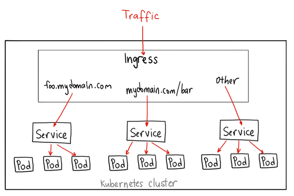

# Traefik

from: [Kubernetes User Guide for v1.7](https://docs.traefik.io/v1.7/user-guide/kubernetes/)

<!-- @import "[TOC]" {cmd="toc" depthFrom=2 depthTo=6 orderedList=false} -->

<!-- code_chunk_output -->

- [Setup](#setup)
- [TLS](#tls)
- [Basic Authentication](#basic-authentication)
- [Name-based Routing](#name-based-routing)
- [Path-based Routing](#path-based-routing)
- [Routing Priority](#routing-priority)
- [Forwarding to ExternalNames](#forwarding-to-externalnames)
  - [Services without selectors (ExternalName)](#services-without-selectors-externalname)
- [Disable passing the host header](#disable-passing-the-host-header)
  - [Disable globally](#disable-globally)
  - [Disable per Ingress](#disable-per-ingress)
- [Traffic Splitting](#traffic-splitting)
- [Mirroring](#mirroring)

<!-- /code_chunk_output -->



## Setup

deploy can be one of

- DaemonSet: Suggestion. Efficient but less flexibility
- Deployment
- [Helm](https://github.com/kubernetes/charts/tree/master/stable/traefik)

create cluster

```bash
k apply -f https://raw.githubusercontent.com/containous/traefik/v1.7/examples/k8s/traefik-rbac.yaml
k apply -f https://raw.githubusercontent.com/containous/traefik/v1.7/examples/k8s/traefik-ds.yaml
k apply -f https://raw.githubusercontent.com/containous/traefik/v1.7/examples/k8s/ui.yaml
k port-forward ds/traefik-ingress-controller 11080:8080 --address 0.0.0.0 -n kube-system
curl http://127.0.0.1:11080
```

## TLS

add a TLS entrypoint by adding the following `args`

```bash
 --defaultentrypoints=http,https
 --entrypoints=Name:https Address::443 TLS
 --entrypoints=Name:http Address::80
```

add the TLS port either to the DaemonSet

```bash
ports:
- name: https
  containerPort: 443
  hostPort: 443
```

To setup an HTTPS-protected ingress, you can leverage the TLS feature of the ingress resource.

```bash
apiVersion: extensions/v1beta1
kind: Ingress
metadata:
  name: traefik-web-ui
  namespace: kube-system
  annotations:
    kubernetes.io/ingress.class: traefik
spec:
  rules:
  - host: traefik-ui.minikube
    http:
      paths:
      - backend:
          serviceName: traefik-web-ui
          servicePort: 80
  tls:
   - secretName: traefik-ui-tls-cert
```

Generate cert and key

```bash
openssl req -x509 -nodes -days 365 -newkey rsa:2048 -keyout tls.key -out tls.crt -subj "/CN=traefik-ui.minikube"
kubectl -n kube-system create secret tls traefik-ui-tls-cert --key=tls.key --cert=tls.crt
```

The TLS certificates will be added to all entrypoints defined by the ingress annotation `traefik.frontend.entryPoints`. If no such annotation is provided, the TLS certificates will be added to all TLS-enabled `defaultEntryPoints`.

## Basic Authentication

```bash
htpasswd -c ./auth myusername
kubectl create secret generic mysecret --from-file auth --namespace=monitoring
```

Following is a full Ingress example based on Prometheus:

```yaml
apiVersion: extensions/v1beta1
kind: Ingress
metadata:
 name: prometheus-dashboard
 namespace: monitoring
 annotations:
   kubernetes.io/ingress.class: traefik
   traefik.ingress.kubernetes.io/auth-type: "basic"
   traefik.ingress.kubernetes.io/auth-secret: "mysecret"
spec:
 rules:
 - host: dashboard.prometheus.example.com
   http:
     paths:
     - backend:
         serviceName: prometheus
         servicePort: 9090
```

## Name-based Routing

checkout

- [cheese-deployments.yaml](example/traefik/cheese-deployments.yaml)
- [cheese-services.yaml](example/traefik/cheese-services.yaml)
- [cheese-ingress.yaml](example/traefik/cheese-ingress.yaml)

Set cluster FQDN

```bash
echo "10.0.0.10 stilicon.kubernetes cheddar.kubernetes wensleydale.kubernetes" | sudo tee -a /etc/hosts
```

## Path-based Routing

checkout

- [cheeses-ingress.yaml](example/traefik/cheeses-ingress.yaml)

## Routing Priority

Sometimes you need to specify priority for ingress routes, especially when handling **wildcard** routes. This can be done by adding the `traefik.frontend.priority` annotation, i.e.:

```yaml
apiVersion: extensions/v1beta1
kind: Ingress
metadata:
  name: wildcard-cheeses
  annotations:
    traefik.frontend.priority: "1"
spec:
  rules:
  - host: *.minikube
    http:
      paths:
      - path: /
        backend:
          serviceName: stilton
          servicePort: http

kind: Ingress
metadata:
  name: specific-cheeses
  annotations:
    traefik.frontend.priority: "2"
spec:
  rules:
  - host: specific.minikube
    http:
      paths:
      - path: /
        backend:
          serviceName: stilton
          servicePort: http
```

## Forwarding to ExternalNames

When specifying an ExternalName, Traefik will forward requests to the given host accordingly and use HTTPS when the Service port matches 443. This still requires setting up a proper port mapping on the Service from the Ingress port to the (external) Service port.

### Services without selectors (ExternalName)

Services most commonly abstract access to Kubernetes Pods, but they can also abstract other kinds of backends. For example:

- You want to have an **external database cluster** in production, but in your test environment you use your own databases.
- You want to point your **Service to a Service in a different Namespace or on another cluster**.
- You are **migrating a workload to Kubernetes**. Whilst evaluating the approach, you run only a proportion of your backends in Kubernetes.

In any of these scenarios you can define a Service without a Pod selector. For example:

```yaml
apiVersion: v1
kind: Service
metadata:
  name: my-service
spec:
  ports:
    - protocol: TCP
      port: 80
      targetPort: 9376
```

Because this Service has no selector, the corresponding Endpoint object is not created automatically. You can **manually map the Service to the network address and port** where it’s running, by adding an Endpoint object manually:

```yaml
apiVersion: v1
kind: Endpoints
metadata:
  name: my-service
subsets:
  - addresses:
      - ip: 192.0.2.42
    ports:
      - port: 9376

```

## Disable passing the host header

By default Traefik will pass the incoming Host header to the upstream resource.

### Disable globally

Add the following to your TOML configuration file:

```toml
disablePassHostHeaders = true
```

### Disable per Ingress

`traefik.frontend.passHostHeader`

```yaml
apiVersion: extensions/v1beta1
kind: Ingress
metadata:
  name: example
  annotations:
    kubernetes.io/ingress.class: traefik
    traefik.frontend.passHostHeader: "false"
spec:
  rules:
  - host: example.com
    http:
      paths:
      - path: /static
        backend:
          serviceName: static
          servicePort: https
---
apiVersion: v1
kind: Service
metadata:
  name: static
spec:
  ports:
  - name: https
    port: 443
  type: ExternalName
  externalName: static.otherdomain.com
```

## Traffic Splitting

```yaml
apiVersion: extensions/v1beta1
kind: Ingress
metadata:
  annotations:
    traefik.ingress.kubernetes.io/service-weights: |
      my-app: 99%
      my-app-canary: 1%
  name: my-app
spec:
  rules:
  - http:
      paths:
      - backend:
          serviceName: my-app
          servicePort: 80
        path: /
      - backend:
          serviceName: my-app-canary
          servicePort: 80
        path: /
```

## Mirroring

not support in v1.X
